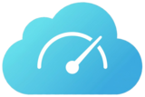
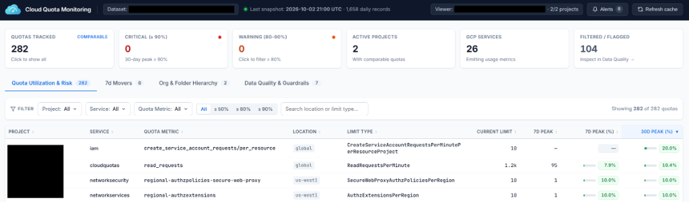
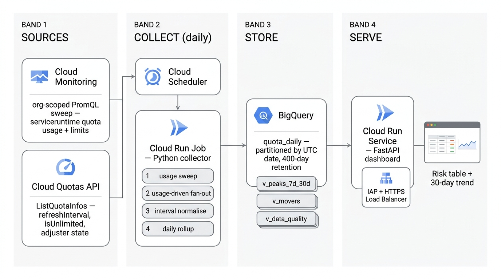

# Google Cloud Quota Monitoring Solution (QMS v6)

<p align="left">
  
</p>

> Organization-wide Google Cloud quota monitoring, 7-day and 30-day peak utilization tracking, Quota Adjuster posture visibility, and a self-hosted Cloud Console-style dashboard on Cloud Run protected by Direct Cloud Run Identity-Aware Proxy (IAP) and per-user `cloudquotas.viewer` authorization.

---

## Contents

* [1. Overview](#1-overview)
  * [Key Capabilities in v6](#key-capabilities-in-v6)
* [2. Architecture](#2-architecture)
  * [2.1 Handling Compute Engine CPU/GPU Family Quotas & Cloud Storage Egress Quotas](#21-handling-compute-engine-cpugpu-family-quotas--cloud-storage-egress-quotas)
* [3. Repository Layout](#3-repository-layout)
* [4. Deployment Guide](#4-deployment-guide)
  * [4.1 Before You Begin (Key Google Cloud Concepts & Prerequisites)](#41-before-you-begin-key-google-cloud-concepts--prerequisites)
  * [4.2 Step-by-Step Deployment](#42-step-by-step-deployment)
  * [4.3 Opening the Dashboard & Granting Access to Teammates](#43-opening-the-dashboard--granting-access-to-teammates)
  * [4.4 Troubleshooting & Updating](#44-troubleshooting--updating)
* [5. Local Development & Testing](#5-local-development--testing)
* [6. Cost](#6-cost)
  * [6.1 Cost Components](#61-cost-components)
  * [6.2 Estimated Monthly Cost & Scaling by Project Count](#62-estimated-monthly-cost--scaling-by-project-count)
* [7. Getting Support & Contributing](#7-getting-support--contributing)

---

## 1. Overview

Google Cloud enforces [quotas](https://cloud.google.com/docs/quota) on resource usage across projects, folders, and organizations. **Quota Monitoring Solution (QMS v6)** provides an automated, low-cost, organization-wide quota observability platform built on **Cloud Run**, **BigQuery**, the **Cloud Quotas API**, and **Cloud Monitoring PromQL**.



### Key Capabilities in v6

* **Accurate Quota Utilization Semantics**: Normalizes rate-quota consumption (`serviceruntime.googleapis.com/quota/rate/net_usage`) to the exact enforcement interval (`refreshInterval`: per-second such as Cloud Storage egress bandwidth `storage.googleapis.com/google_egress_bandwidth` and `internet_egress_bandwidth`, per-minute, per-100-seconds, or per-day on `US/Pacific` boundaries) and joins usage to authoritative limits via `QuotaInfo.quotaId ≡ limit_name` from the **Cloud Quotas API** (`cloudquotas.googleapis.com`).
* **Compute Engine Generation 1 & Generation 2 Custom-Dimension Family Quotas**: Full support for both dedicated family metrics (`n2_cpus`, `c3_cpus`, `nvidia_l4_gpus`, `gpus_all_regions`, etc. on `monitored_resource="consumer_quota"`) and **Generation 2 custom-dimension family quotas** (`compute.googleapis.com/cpus_per_vm_family/<VM_FAMILY>`, `compute.googleapis.com/gpus_per_gpu_family/<GPU_FAMILY>`, `compute.googleapis.com/local_ssd_total_storage_per_vm_family/<VM_FAMILY>`, `compute.googleapis.com/tpus_per_tpu_family/<TPU_FAMILY>` emitted on `monitored_resource="compute.googleapis.com/Location"` with `vm_family` / `gpu_family` / `tpu_family` labels), resolving per-family regional limits using 4-tier `dimensionsInfos` specificity precedence (`location + family` > `family default` > `location default` > `global default`).
* **Comparability Guardrails**: Automatically detects and withholds non-comparable pairings (such as project-aggregate usage vs. per-user limits `dimensions: ["user"]`) and normalizes unlimited quota sentinels (`9223372036854775807` and `-1`), surfacing full telemetry in a dedicated **Data Quality & Guardrails** tab.
* **7-Day & 30-Day Peak Tracking**: Stores daily peak and current usage in a partitioned, clustered BigQuery table (`quota_daily`, 400-day retention) backed by six precomputed BigQuery views (`quota_latest`, `quota_peaks`, `quota_risk`, `quota_movers`, `quota_hierarchy`, `quota_quality`).
* **Self-Hosted Cloud Console UI (`qms-dashboard`)**: Fast, zero-dependency Cloud Console design featuring cascading searchable dropdowns (`Project`, `Service`, `Quota Metric`), instant threshold filters (`All`, `>= 50%`, `>= 80%`, `>= 90%`), a 30-day interactive trend drawer, **7d Movers**, and **Org & Folder Hierarchy** rollups (including read-only **Quota Adjuster** status per project).
* **Direct Cloud Run IAP + Per-User IAM Scoping**: Authenticates users at Google's edge via Direct Cloud Run IAP (no External Load Balancer required) and dynamically filters dashboard data to the exact Organization, Folder, or Project scopes where the logged-in user holds `roles/cloudquotas.viewer` (or `cloudquotas.quotaInfos.list`).
* **Lightweight Zero-Config Alerting**:
  * **In-Browser Alert Bell & Desktop Push Notifications**: Alerts badge (`>= 80%`) in the top Console header with native Web Push notifications when a daily collection detects quota threshold breaches.
  * **1-Click Cloud Console Real-Time Alerting**: Every quota's detail drawer generates a ready-to-paste PromQL condition (`>= 80%` of the authoritative limit) and direct deep links to create a Cloud Monitoring Alert Policy or manage the quota in Google Cloud Console.
  * **Structured Collector Summary & Optional Webhook**: Emits a structured `QMS_QUOTA_THRESHOLD_SUMMARY` JSON event to Cloud Logging after each run and supports an optional Slack or Google Chat incoming webhook (`QMS_ALERT_WEBHOOK_URL`).

---

## 2. Architecture



One container image (`Dockerfile`) powers two serverless Cloud Run workloads in a single host project:

1. **`qms-collector` (Cloud Run Job)**: Triggered daily by **Cloud Scheduler** (`qms-daily-collect`). Walks active projects across the organization (`HierarchySource`), queries Cloud Monitoring PromQL (`MonitoringSource`) concurrently across a bounded worker pool (`QMS_COLLECTOR_WORKERS=8`), fetches authoritative quota definitions and Quota Adjuster settings from the Cloud Quotas API (`CloudQuotasSource`) using a thread-safe token-bucket rate limiter (`14 RPS` / `840 RPM`, staying safely below the host project's `1,200 RPM` `ReadRequestsPerMinute` quota with exponential backoff on `HTTP 429`/`5xx`), normalizes daily peaks, and loads rows into BigQuery (`BigQuerySink`) via free batch load jobs.
2. **`qms-dashboard` (Cloud Run Service)**: Read-only FastAPI service (`min_instance_count = 0`, `512 MiB` RAM) behind **Direct Cloud Run IAP**:
   * **Partition-Pruned Precomputed Views**: All six BigQuery views (`quota_latest`, `quota_peaks`, `quota_risk`, `quota_movers`, `quota_hierarchy`, `quota_quality`) enforce `usage_date_utc` partition pruning (`30–35` days) so refreshes scan only active partitions rather than the full 400-day retention window.
   * **Uncapped Facet Catalog + Bounded Memory (`QMS_RISK_CACHE_LIMIT=15000`)**: Populates the **Project**, **Service**, and **Quota Metric** searchable dropdowns from a complete `(project_id, service, quota_metric)` facet index across all 100–500+ projects while capping DOM rendering at 500 rows and dynamically fetching filtered slices via `GET /api/risk`.
   * **Single-RPC Org IAM Fast Path + SWR Cache**: Evaluates per-user access in a single `organizations/{org_id}:analyzeIamPolicy` (`expandResources=true, expandGroups=true`) call when Cloud Asset Inventory is available, falling back to bounded concurrent Cloud Resource Manager `getIamPolicy` checks only for fresh unindexed grants or custom roles, backed by Stale-While-Revalidate (SWR) caching.

### 2.1 Handling Compute Engine CPU/GPU Family Quotas & Cloud Storage Egress Quotas

Compute Engine CPU/GPU family quotas and Cloud Storage egress bandwidth quotas are the most frequently monitored capacity limits in production, and both suffered from architectural blind spots in legacy QMS versions (v5 and earlier):

1. **Why Legacy QMS Missed or Miscalculated Compute Engine `CPUs per VM Family` & `GPUs per GPU Family`:**
   * **Generation 1 Family Quotas (`n2_cpus`, `c2_cpus`, `a2_cpus`, `nvidia_l4_gpus`, `nvidia_a100_80gb_gpus`, `gpus_all_regions`):** Emitted as distinct `quota_metric` values on `serviceruntime.googleapis.com/quota/allocation/usage` (`monitored_resource="consumer_quota"`). In legacy v5, a shared mutable accumulator in `ScanProjectQuotasHelper.java` leaked running maximums across metrics in the same project, and MQL `join` queries failed whenever sparse `serviceruntime.googleapis.com/quota/limit` time series were absent.
   * **Generation 2 Custom-Dimension Family Quotas (`cpus_per_vm_family`, `gpus_per_gpu_family`, `local_ssd_total_storage_per_vm_family`, `tpus_per_tpu_family`):** Newer Compute Engine machine and accelerator families (`C4`, `N4`, `C3D`, `Z3`, `NVIDIA_H100`, `NVIDIA_H200`, `NVIDIA_B200`, etc.) are **not** emitted on `serviceruntime.googleapis.com/quota/allocation/usage` (`consumer_quota`). Instead, Compute Engine emits them on service-specific metrics (`compute.googleapis.com/quota/<suffix>/{usage,limit}`) under **`monitored_resource="compute.googleapis.com/Location"`** with custom dimension labels (`vm_family`, `gpu_family`, `tpu_family`), and returns multi-dimensional limit overrides inside a single `QuotaInfo.dimensionsInfos` list (`dimensions: ["region", "vm_family"]`). Because v5 only queried `consumer_quota` and did not parse custom-dimension `dimensionsInfos`, Generation 2 CPU and GPU family quotas never surfaced.
   * **How QMS v6 Fixes It:**
     * Queries both `serviceruntime.googleapis.com/quota/allocation/usage` (`monitored_resource="consumer_quota"`) and the four `compute.googleapis.com/quota/<suffix>/usage` metrics (`monitored_resource="compute.googleapis.com/Location"`), normalizing each active family into a dedicated metric key (`compute.googleapis.com/cpus_per_vm_family/C4`, `compute.googleapis.com/gpus_per_gpu_family/NVIDIA_H100`, etc.).
     * Expands multi-dimensional `QuotaInfo.dimensionsInfos` from the **Cloud Quotas API** into per-family `QuotaDefinition` entries using deterministic 4-tier specificity precedence: `(location + family)` > `(family default)` > `(location default)` > `(global empty-dimensions default)`.
     * Generates ready-to-paste `monitored_resource="compute.googleapis.com/Location"` PromQL alert expressions (including the exact `vm_family`, `gpu_family`, or `tpu_family` selector) in the dashboard detail drawer.

2. **Why Legacy QMS Inflated Cloud Storage Egress Bandwidth Quotas (`google_egress_bandwidth`, `internet_egress_bandwidth`):**
   * Cloud Storage egress bandwidth quotas are **per-second rate quotas** (`refreshInterval: "second"`, `interval_seconds = 1`, measured in bytes/second), whereas Cloud Monitoring samples `serviceruntime.googleapis.com/quota/rate/net_usage` as a **60-second `DELTA`** (`[1m]`).
   * Legacy v5 divided 60-second (or 24-hour) byte deltas directly by the 1-second bandwidth limit without interval normalization, inflating reported utilization by `60x` to `86,400x`.
   * **How QMS v6 Fixes It:** Reads `QuotaInfo.refreshInterval` from the Cloud Quotas API and rescales the peak 1-minute delta onto the limit's 1-second enforcement window (`scale_usage_to_interval(..., measured_over_seconds=60, limit_interval_seconds=1)`)—and includes `/ 60` normalization in the 1-click Cloud Console PromQL alert generator—so egress bandwidth utilization is always compared in bytes/second against the bytes/second limit.

---

## 3. Repository Layout

```text
collector/            # Python package for quota collection, normalization, and BigQuery views
  sources/            #   monitoring.py (PromQL + retry), cloud_quotas.py (14 RPS limiter + retry), hierarchy.py
  sinks/              #   bigquery.py (batch load jobs), views.py (6 partition-pruned SQL views)
  alerts.py           #   Zero-config threshold evaluation, webhook digest, and PromQL builder
  model.py            #   Immutable domain types and comparability flags
  normalise.py        #   Enforcement interval and unlimited-sentinel normalization
  rollup.py           #   Daily peak/current rollup across UTC and US/Pacific boundaries
  cli.py              #   Parallel CLI entry point: `collect` | `backfill` | `verify` | `views`
dashboard/            # Self-hosted FastAPI + Jinja2 Cloud Console UI
  app.py              #   HTTP routes, health checks, /api/risk, and /api/alerts
  authz.py            #   IAP ES256 JWT verification, 1-RPC Org CAI fast path, and SWR authz cache
  queries.py          #   Concurrent BigQuery view reader with uncapped facet index & SWR caching
  static/             #   QMS logo and browser tab favicons
  templates/          #   base.html and index.html (Risk, Movers, Hierarchy, Quality, Drawer)
terraform/            # Terraform >= 1.5 / google provider ~> 8.0
  modules/qms/        #   Reusable QMS module (Cloud Run Job + Service, BigQuery, Scheduler, IAM)
  example/            #   Example root module
tests/                # Golden-file and unit test suite (pytest, 112 tests)
```

---

## 4. Deployment Guide

This guide walks you through deploying QMS v6 from start to finish using standard terminal commands—no prior Google Cloud experience, local Docker daemon, or AI coding assistant is required.

For a deeper architectural breakdown of the Terraform resources and least-privilege IAM bindings, see [`terraform/README.md`](terraform/README.md).

---

### 4.1 Before You Begin (Key Google Cloud Concepts & Prerequisites)

If you are migrating from AWS, Azure, or on-premises infrastructure, QMS uses two core Google Cloud hierarchy concepts:

1. **Google Cloud Organization (`ORG_ID`)** *(similar to an AWS Organizations Root or Azure Tenant)*:
   The top-level root node of your company's Google Cloud resources. It is identified by a **numeric ID** (for example, `123456789012`), not your domain name. QMS scans quota usage across all active projects inside this Organization.
2. **Host Project (`PROJECT_ID`)** *(similar to a dedicated AWS Account or Azure Subscription)*:
   A single Google Cloud project (with billing enabled) where QMS deploys its own components: the BigQuery dataset (`quota_monitoring`), the Artifact Registry container repository (`qms`), the daily collector (`qms-collector` Cloud Run Job), the web UI (`qms-dashboard` Cloud Run Service), and the daily cron trigger (`qms-daily-collect` Cloud Scheduler job). Every project has a globally unique **Project ID** slug (for example, `my-company-qms-host`).

#### Where to Run These Commands

* **Option A — Google Cloud Shell (Recommended for first-time GCP users):**
  Open the [Google Cloud Console](https://console.cloud.google.com/) in your browser and click the **Activate Cloud Shell (`>_`)** icon in the top-right navigation bar. Cloud Shell is a free browser-based terminal that comes **pre-installed with `git`, `gcloud`, and `terraform`**—nothing needs to be installed on your computer.
* **Option B — Your Local Workstation:**
  If you prefer running from your own machine, install:
  * [Google Cloud CLI (`gcloud`)](https://cloud.google.com/sdk/docs/install)
  * [Terraform (`>= 1.5`)](https://developer.hashicorp.com/terraform/install)
  * `git`

#### Required Permissions to Deploy

The Google account you sign in with needs permissions on both the **Host Project** (to create the infrastructure) and the **Organization** (to grant read-only quota/monitoring viewer roles to the QMS service accounts):

* **On the Host Project (`PROJECT_ID`):** `Project Owner` (`roles/owner`), **or** `Editor` (`roles/editor`) + `Project IAM Admin` (`roles/resourcemanager.projectIamAdmin`) + `Cloud Run Admin` (`roles/run.admin`) + `Service Account Admin` (`roles/iam.serviceAccountAdmin`).
* **On the Organization (`ORG_ID`):**
  * `Organization IAM Admin` (`roles/resourcemanager.organizationAdmin`) — allows Terraform to bind read-only viewer roles (`roles/monitoring.viewer`, `roles/cloudquotas.viewer`, `roles/browser`, `roles/cloudasset.viewer`, `roles/iam.securityReviewer`) to the QMS service accounts.
  * `Cloud Quotas Viewer` (`roles/cloudquotas.viewer`) — allows your own user account to view organization-wide quotas once you open the dashboard.

<details>
<summary><strong>Need an administrator to grant you these roles first? (Click to expand commands)</strong></summary>

Ask an existing Organization Administrator to run the following commands, replacing the email, project ID, and organization ID with yours:

```bash
# Grant Project Owner on the Host Project
gcloud projects add-iam-policy-binding YOUR_HOST_PROJECT_ID \
  --member="user:YOUR_EMAIL@example.com" \
  --role="roles/owner"

# Grant Organization IAM Admin and Cloud Quotas Viewer at the Organization level
gcloud organizations add-iam-policy-binding YOUR_ORG_ID \
  --member="user:YOUR_EMAIL@example.com" \
  --role="roles/resourcemanager.organizationAdmin"

gcloud organizations add-iam-policy-binding YOUR_ORG_ID \
  --member="user:YOUR_EMAIL@example.com" \
  --role="roles/cloudquotas.viewer"
```
</details>

#### Required Google Cloud APIs (Host Project vs. Monitored Projects)

QMS interacts with two sets of projects: the single **Host Project (`PROJECT_ID`)** where QMS runs, and the **Monitored Projects** across your Organization whose quotas are queried.

##### 1. APIs in the Host Project (`PROJECT_ID`) — *Automatically Enabled by Terraform in Step 4*

Terraform (`module.qms.google_project_service.this`) automatically enables the 13 required APIs on your Host Project during Step 4:

| Service API | Service Name | Purpose in Host Project |
| --- | --- | --- |
| **Cloud Quotas API** | `cloudquotas.googleapis.com` | Queries authoritative `QuotaInfo` limits, dimensions, enforcement intervals, and `QuotaAdjusterSettings` across all projects (using the Host Project via `x-goog-user-project`) |
| **Cloud Monitoring API** | `monitoring.googleapis.com` | Queries PromQL quota usage time series (`serviceruntime.googleapis.com/quota/*`) |
| **Cloud Run Admin API** | `run.googleapis.com` | Hosts the `qms-collector` Cloud Run Job and `qms-dashboard` Cloud Run Service |
| **BigQuery API** | `bigquery.googleapis.com` | Stores the `quota_monitoring` dataset, `quota_daily` table, and 6 analytical views |
| **Cloud Build API** | `cloudbuild.googleapis.com` | Builds the container image remotely in Step 5 |
| **Artifact Registry API** | `artifactregistry.googleapis.com` | Stores the QMS Docker container image (`qms` repository) |
| **Cloud Scheduler API** | `cloudscheduler.googleapis.com` | Triggers the daily `qms-daily-collect` cron schedule |
| **Cloud Identity-Aware Proxy API** | `iap.googleapis.com` | Secures `qms-dashboard` with Direct Cloud Run IAP authentication |
| **Cloud Resource Manager API** | `cloudresourcemanager.googleapis.com` | Discovers Organization, Folder, and Project hierarchy and evaluates fallback IAM policies |
| **Cloud Asset API** | `cloudasset.googleapis.com` | Performs single-RPC organization-wide IAM policy evaluation (`analyzeIamPolicy`) for dashboard users |
| **Identity and Access Management API** | `iam.googleapis.com` | Creates and manages the 4 dedicated least-privilege QMS service accounts |
| **Cloud Storage API** | `storage.googleapis.com` | Stages source archives in `${PROJECT_ID}-qms-build-source` for Cloud Build |
| **Cloud Logging API** | `logging.googleapis.com` | Stores Cloud Build logs, collector execution logs, and `QMS_QUOTA_THRESHOLD_SUMMARY` events |

<details>
<summary><strong>Want to enable the Host Project APIs manually via <code>gcloud</code>? (Click to expand)</strong></summary>

```bash
gcloud services enable \
  artifactregistry.googleapis.com \
  bigquery.googleapis.com \
  cloudasset.googleapis.com \
  cloudbuild.googleapis.com \
  cloudquotas.googleapis.com \
  cloudresourcemanager.googleapis.com \
  cloudscheduler.googleapis.com \
  iam.googleapis.com \
  iap.googleapis.com \
  logging.googleapis.com \
  monitoring.googleapis.com \
  run.googleapis.com \
  storage.googleapis.com \
  --project="$PROJECT_ID"
```
</details>

##### 2. APIs in the Monitored Projects (Projects Whose Quotas Are Queried)

You do **not** need to deploy any infrastructure or enable all 13 APIs inside the target projects being monitored across your Organization:

| Service API | Service Name | Required in Each Monitored Project? | Why |
| --- | --- | --- | --- |
| **Cloud Monitoring API** | `monitoring.googleapis.com` | **Yes** *(enabled by default on Google Cloud projects)* | Cloud Monitoring PromQL (`projects/{project}/location/global/prometheus/api/v1/query_range`) queries each monitored project's metrics endpoint directly for `serviceruntime.googleapis.com/quota/*` usage time series. If disabled on a project, enable it with `gcloud services enable monitoring.googleapis.com --project=TARGET_PROJECT_ID`. |
| **Cloud Quotas API** | `cloudquotas.googleapis.com` | **No** *(only required on the Host Project)* | `qms-collector` attaches `x-goog-user-project: <HOST_PROJECT_ID>` to every Cloud Quotas API call, routing API enablement checks and `ReadRequestsPerMinute` quota accounting through the **Host Project** so you do not have to enable `cloudquotas.googleapis.com` across hundreds of existing projects. |

---

### 4.2 Step-by-Step Deployment

#### Step 1: Authenticate with Google Cloud

Run the following commands to sign in with your Google Cloud account and provide credentials for Terraform:

```bash
# 1. Sign in to the gcloud CLI (in Cloud Shell, this just confirms your active session)
gcloud auth login

# 2. Sign in for Terraform (Application Default Credentials)
gcloud auth application-default login
```

*(Each command opens a browser link or prompt—sign in with your Google Cloud email and approve access.)*

---

#### Step 2: Look Up Your IDs & Set Environment Variables

If you do not already know your numeric **Organization ID** or **Host Project ID**, list them with:

```bash
# List your Organization(s) — copy the numeric value in the ID column
gcloud organizations list

# List your Projects — copy the slug in the PROJECT_ID column for your host project
gcloud projects list
```

Now set the four variables below in your terminal. **Every command in Steps 3–7 uses these variables automatically**, so you only need to fill them in once right here:

```bash
export PROJECT_ID="your-host-project-id"          # e.g., my-qms-host-project
export ORG_ID="123456789012"                      # Numeric ID from `gcloud organizations list`
export REGION="asia-south1"                       # e.g., us-central1, europe-west1, asia-south1
export ADMIN_EMAIL="you@example.com"              # Your Google Cloud sign-in email

# Set your active gcloud project
gcloud config set project "$PROJECT_ID"
```

---

#### Step 3: Clone the Repository & Create `terraform.tfvars`

Clone the repository and generate your `terraform/example/terraform.tfvars` configuration file from the variables you exported in Step 2:

```bash
git clone https://github.com/RootedRover/quota-monitoring-solution.git
cd quota-monitoring-solution

cat <<EOF > terraform/example/terraform.tfvars
project_id      = "${PROJECT_ID}"
organization_id = "${ORG_ID}"
region          = "${REGION}"

image = "${REGION}-docker.pkg.dev/${PROJECT_ID}/qms/qms:v6"

# Users or Google Groups allowed to open the dashboard URL via Identity-Aware Proxy (IAP).
# Use "user:email@domain.com" for individuals or "group:team@domain.com" for Google Groups.
dashboard_invokers = [
  "user:${ADMIN_EMAIL}",
]

collection_schedule = "30 2 * * *"
schedule_time_zone  = "Etc/UTC"
EOF
```

> **Tip:** Run `cat terraform/example/terraform.tfvars` to double-check that none of the values are blank before continuing.

---

#### Step 4: Bootstrap Build Infrastructure (Terraform Phase 1)

Cloud Run requires the container image to exist in Artifact Registry before creating the job and dashboard service. In this step, Terraform enables the required Google Cloud APIs and creates the Artifact Registry repository, the Cloud Build source staging bucket, and the dedicated `qms-build` service account:

```bash
terraform -chdir=terraform/example init

terraform -chdir=terraform/example apply \
  -target=module.qms.google_project_service.this \
  -target=module.qms.google_artifact_registry_repository.qms \
  -target=module.qms.google_storage_bucket.build_source \
  -target=module.qms.google_service_account.build \
  -target=module.qms.google_artifact_registry_repository_iam_member.build_pushes \
  -target=module.qms.google_storage_bucket_iam_member.build_reads_source \
  -target=module.qms.google_project_iam_member.build_logs
```

When Terraform prints `Do you want to perform these actions?`, type **`yes`** and press **Enter**.

---

#### Step 5: Build & Push the Container Image in Cloud Build

Next, submit the repository to **Google Cloud Build**, which builds the Docker image remotely in Google Cloud (no local Docker installation required) and pushes it to your Artifact Registry repository:

```bash
gcloud builds submit \
  --project="$PROJECT_ID" \
  --region="$REGION" \
  --config=cloudbuild.yaml \
  --gcs-source-staging-dir="gs://${PROJECT_ID}-qms-build-source/source" \
  --service-account="projects/${PROJECT_ID}/serviceAccounts/qms-build@${PROJECT_ID}.iam.gserviceaccount.com" \
  .
```

Wait \~1–2 minutes for the build to finish with `STATUS: SUCCESS`.

---

#### Step 6: Deploy BigQuery, Cloud Run Workloads & Scheduler (Terraform Phase 2)

Now that the container image is in Artifact Registry, run a full `terraform apply` to provision the `quota_monitoring` BigQuery dataset, the `qms-collector` Cloud Run Job, the `qms-dashboard` Cloud Run Service (with Direct Cloud Run IAP enabled), and the `qms-daily-collect` Cloud Scheduler job:

```bash
terraform -chdir=terraform/example apply
```

Type **`yes`** and press **Enter** when prompted. When complete, Terraform will print your live `dashboard_url`.

---

#### Step 7: Create BigQuery Views & Run Your First Quota Collection

Finally, trigger the `qms-collector` Cloud Run Job to create the 6 BigQuery views (`quota_latest`, `quota_peaks`, `quota_risk`, `quota_movers`, `quota_hierarchy`, `quota_quality`) and run your first quota collection sweep across your Organization (this runs entirely on Cloud Run—no local Python setup required):

```bash
# 1. Create the 6 partition-pruned BigQuery views
gcloud run jobs execute qms-collector \
  --project="$PROJECT_ID" \
  --region="$REGION" \
  --args="-m,collector.cli,views" \
  --wait

# 2. Run an initial 30-day backfill + collection so 7d and 30d peaks are populated immediately
gcloud run jobs execute qms-collector \
  --project="$PROJECT_ID" \
  --region="$REGION" \
  --args="-m,collector.cli,--days,30,collect" \
  --wait
```

*(After this initial 30-day backfill, Cloud Scheduler will automatically run the default 7-day rolling collection every night at `02:30`.)*

---

### 4.3 Opening the Dashboard & Granting Access to Teammates

#### Open the Dashboard in Your Browser

Print your live dashboard URL and open it in your browser:

```bash
terraform -chdir=terraform/example output -raw dashboard_url && echo
```

Because **Direct Cloud Run IAP** is enabled, opening that URL in your browser automatically signs you in with your Google corporate identity—no local proxy tunnel is needed.

#### Granting Dashboard Access to Additional Users or Teams

QMS enforces a **two-layer security model** so different teams can safely share a single dashboard URL while only seeing the projects they are authorized to view:

1. **Layer 1 — Who Can Open the Dashboard URL (Identity-Aware Proxy):**
   Add the user (`"user:alice@example.com"`) or Google Group (`"group:cloud-platform@example.com"`) to `dashboard_invokers` in `terraform/example/terraform.tfvars`, then re-run `terraform -chdir=terraform/example apply`.
2. **Layer 2 — Which Projects Each User Sees Inside the Dashboard (Row-Level IAM):**
   The dashboard automatically checks which projects the signed-in user has permission to inspect (`cloudquotas.quotaInfos.list`, included in the standard **`roles/cloudquotas.viewer`** role).
   * **To let a user see all projects in the Organization:**
     ```bash
     gcloud organizations add-iam-policy-binding "$ORG_ID" \
       --member="user:alice@example.com" \
       --role="roles/cloudquotas.viewer"
     ```
   * **To let a user see only projects inside a specific Folder:**
     ```bash
     gcloud resource-manager folders add-iam-policy-binding FOLDER_ID \
       --member="user:alice@example.com" \
       --role="roles/cloudquotas.viewer"
     ```
   * **To let a user see only a single Project:**
     ```bash
     gcloud projects add-iam-policy-binding TARGET_PROJECT_ID \
       --member="user:alice@example.com" \
       --role="roles/cloudquotas.viewer"
     ```

---

### 4.4 Troubleshooting & Updating

| Symptom | Cause & Fix |
| --- | --- |
| **Browser shows `403 Forbidden` / IAP access screen when opening `dashboard_url`** | 1. Ensure your email or Google Group is listed in `dashboard_invokers` in `terraform/example/terraform.tfvars` and run `terraform -chdir=terraform/example apply`.<br>2. If you just ran `terraform apply`, wait \~1–2 minutes for IAM policy propagation and refresh the browser tab. |
| **Dashboard loads, but shows `0 projects in your scope (Access Restricted)`** | You have IAP access to open the web app, but your user account does not yet hold `roles/cloudquotas.viewer` on any monitored project, folder, or organization. Grant `roles/cloudquotas.viewer` using one of the commands in [Section 4.3](#43-opening-the-dashboard--granting-access-to-teammates). |
| **`terraform apply` fails with `Error 403` on `google_organization_iam_member`** | Your account needs `roles/resourcemanager.organizationAdmin` at the Organization level (`$ORG_ID`) so Terraform can bind read-only viewer roles to `qms-collector` and `qms-dashboard`. See the expandable admin commands in [Section 4.1](#41-before-you-begin-key-google-cloud-concepts--prerequisites). |
| **`gcloud builds submit` fails with `Permission 'storage.objects.get' denied`** | Ensure you completed **Step 4** (`terraform apply -target=...`) so the `${PROJECT_ID}-qms-build-source` bucket and `qms-build` IAM binding exist, and make sure `--gcs-source-staging-dir="gs://${PROJECT_ID}-qms-build-source/source"` is included in your `gcloud builds submit` command. |
| **A specific monitored project is missing from the dashboard after collection** | 1. Verify `monitoring.googleapis.com` is enabled on that project (`gcloud services enable monitoring.googleapis.com --project=TARGET_PROJECT_ID`).<br>2. Confirm that the project has active API usage emitting `serviceruntime.googleapis.com/quota/*` metrics and that your user account holds `roles/cloudquotas.viewer` on that project (or its parent Folder/Organization). |
| **How do I update the running app after pulling new code?** | 1. Run `git pull`<br>2. Re-run the `gcloud builds submit` command from **Step 5**<br>3. Run:<br>`gcloud run services update qms-dashboard --project="$PROJECT_ID" --region="$REGION" --image="${REGION}-docker.pkg.dev/${PROJECT_ID}/qms/qms:v6"`<br>`gcloud run jobs update qms-collector --project="$PROJECT_ID" --region="$REGION" --image="${REGION}-docker.pkg.dev/${PROJECT_ID}/qms/qms:v6"` |

---

## 5. Local Development & Testing

```bash
# Run formatter, linter (including flake8-bandit security rules), and unit tests
uv run ruff format --check .
uv run ruff check .
uv run pytest

# Reconcile sample quota ratios against Cloud Console
uv run python -m collector.cli \
  --billing-project <HOST_PROJECT_ID> \
  --organization <ORG_ID> \
  --days 7 \
  verify --limit 20
```

---

## 6. Cost

QMS v6 is designed to run at minimal operational cost by combining scale-to-zero serverless workloads, free BigQuery batch load jobs, in-memory stale-while-revalidate view caching, and Direct Cloud Run IAP (avoiding the fixed \~$18/month cost of an External Application Load Balancer).

### 6.1 Cost Components

* **Cloud Run Job (`qms-collector`)**: `1 vCPU`, `1 GiB` memory, executed once daily (`30 2 * * *`). Parallel 8-worker execution with `14 RPS` rate limiting keeps wall-clock runtime short (\~1.5 minutes/day for 100 projects).
* **Cloud Run Service (`qms-dashboard`)**: `1 vCPU`, `512 MiB` memory with `min_instance_count = 0` (scales to zero when idle). Client-side filtering/sorting and a 5-minute Stale-While-Revalidate (SWR) in-memory cache minimize active CPU time.
* **BigQuery (`quota_monitoring`)**:
  * **Ingestion**: Uses batch load jobs (`load_table_from_json`), which are **$0.00 (free)**.
  * **Storage**: Partitioned by `usage_date_utc` and clustered by `(project_id, service, quota_metric)` with 400-day retention (\~1.4 GB logical storage for 100 projects; partitions older than 90 days automatically drop to Long-Term Storage pricing).
  * **Queries**: Views (`quota_latest`, `quota_peaks`, `quota_movers`) prune `quota_daily` to the most recent 30–35 partitions, and the dashboard caches view snapshots in memory for 5 minutes rather than issuing per-click queries.
* **Cloud Monitoring, Cloud Quotas, Cloud Asset & CRM APIs**: Cloud Quotas, Cloud Asset Inventory, and Cloud Resource Manager API calls are free; Cloud Monitoring API reads (`query_range` on GCP `serviceruntime` quota metrics) include 1,000,000 free API read calls/month per billing account ($0.01 per 1,000 calls thereafter).
* **Direct Cloud Run IAP, Cloud Scheduler & Artifact Registry**: Direct Cloud Run IAP has no hourly load-balancer fee; Cloud Scheduler is $0.10/month for the single daily cron job; Artifact Registry stores one \~180 MB container image (\~$0.02/month).

### 6.2 Estimated Monthly Cost & Scaling by Project Count

Because `QuotaInfo` limit definitions are cached per GCP service (`O(distinct services)` rather than `O(projects × services)`), `quota_daily` views are partition-pruned, and the dashboard serves cached view snapshots in memory, total cost scales gently as the number of monitored projects grows:

| Monitored Projects | Daily Collector Runtime | Cloud Run (`qms-collector` + `qms-dashboard`) | BigQuery (Storage + Pruned View Queries) | Monitoring API, Scheduler & Artifact Registry | **Estimated Total Monthly Cost (Gross List Price)** |
| --- | --- | ---: | ---: | ---: | ---: |
| **100 Projects** | \~1.5 min / day | \~$1.45 – $2.00 | \~$0.20 – $1.10 | \~$0.20 – $0.25 | **\~$1.85 – $3.35 / month** |
| **500 Projects** | \~7 min / day | \~$2.10 – $2.80 | \~$0.95 – $2.50 | \~$0.50 – $0.65 | **\~$3.55 – $5.95 / month** |
| **1,000 Projects** | \~14 min / day | \~$3.00 – $3.90 | \~$1.90 – $4.50 | \~$0.90 – $1.10 | **\~$5.80 – $9.50 / month** |

*(When GCP monthly free tiers for Cloud Run, BigQuery 1 TiB query / 10 GB storage, and Cloud Monitoring 1M API reads are available on the billing account, net cost for a 100-project deployment is typically under **$0.25 / month**.)*

> **Disclaimer:** Costs are indicatory and to be used purely for estimation. Actual costs should be monitored for accuracy.

---

## 7. Getting Support & Contributing

* [Contributing guidelines](CONTRIBUTING.md)
* [Code of conduct](code-of-conduct.md)
* Quota Monitoring Solution is an open-source solution and is not officially covered by Google Cloud product support.
